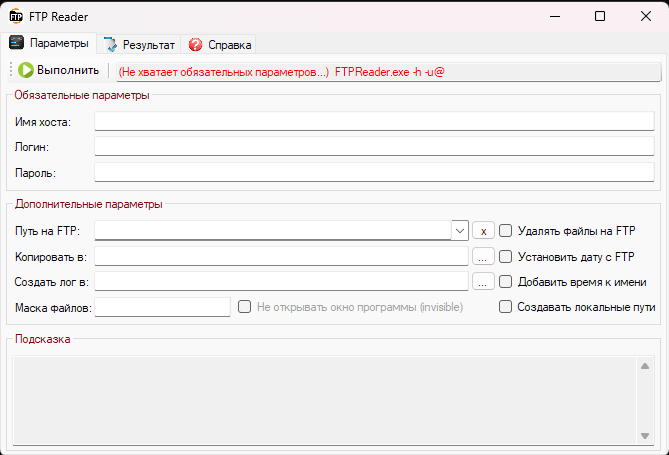

</img>

# FTP-Reader 1C 

### Description  

- Небольшая программка, работающая с интерфейсом и из командной строки для копирования, перемещения, переименования и удаления файлов на сервере FTP.  
- Получает данные из указанной папки FTP, помещает их в указанную локальную папаку. Корректно иеперименоовывет их (в отличие от втроенного 1С клиента FTP), с учетом времени создания файла на FTP.  
- Для работы необходим .Net Framework 4.8 
- В папке Example1C лежит пример обработки 1С, исползующей программу через командную строку. 
- Полная справка по командам и ключам содержится в соответсвующей вкладке окна приложения.  

### Ключи командной строки программы  

#### Обязательные:
-----------------------------
-h  -  (host) имя хоста : порт хоста    -h127.0.0.1:21  (без"ftp://";  порт хоста по умолчанию 21)  
-u  -  (user) Имя пользователя @ Пароль пользователя    -uUser@Pass  

#### Необязательные:
-----------------------------
-m  -  (mask) Маска поиска файлов (по умолчанию *)   -m*.xls*  
-p  -  (path) Стартовый каталог FTP  (по умолчанию корневой "/")   -d"/Ftp Directory_1/Ftp Directory_2"  
-c  -  (copy) Каталог приемник файлов (по умолчанию копирование не производится)   -c"C:\Мои документы\FTP"  
-l  -  (log) Выводить информацию в файл лога (по умолчанию  файл лога не создается)   -l"C:\Temp\My Logs"  
 &ensp; &ensp; &ensp; Пути, содержащие пробелы в кавычках "path"    
 &ensp; &ensp; &ensp; Все пути без завершаюшего слеш.     

#### Без параметров: 
-----------------------------
-r  -  (remove) Удалять файлы в папке FTP. Без ключа файлы не удаляются  
-d  -  (date) Изменять дату скопированных файлов на дату файлов FTP. Без ключа дата не меняется  
-t  -  (time) Добавить к имени файлов дату-время файлов с  FTP. Без ключа имя не меняется  
-g  -  (generate) Создавать папки для локальных путей при их отсутствии. Без ключа пути не создаются  
-i  -  (invisible) Не показывать окно программы + автоматическое прекращение работы программы по завершении  

#### Пример:
-----------------------------
FtpReader.exe -hmicrosoft.com:21 -uUserName@Password -d/FtpDirectory -m*.dbf -p"C:\Temp" -lC:\Temp -g -d -r -i  

#### Коды ошибок:
-----------------------------

0  -  Все файлы из папки FTP обработаны по установленым параметрам  
1  -  Отсутствуют файлы для обработки по установленым параметрам  
2  -  Ошибки при выполнении обработки для отдельных файлов  
3  -  Ошибки при установке соединения с сервером FTP  
4  -  Ошибки при проверке обязательных параметров  
5  -  Ошибки при проверке (создании) локальных путей  

